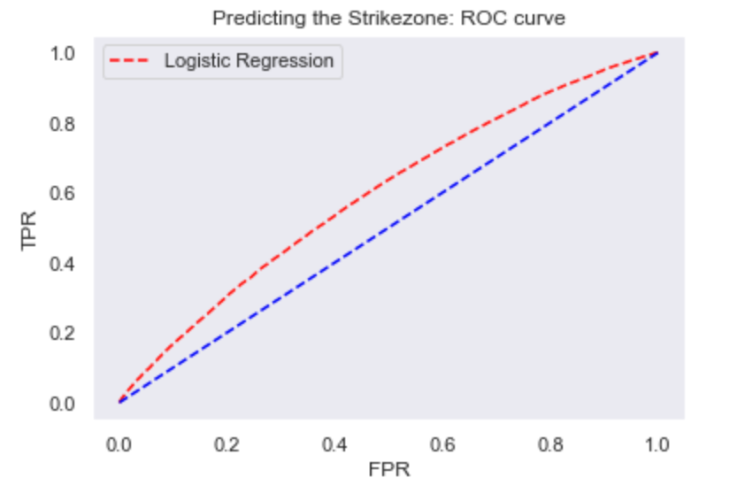
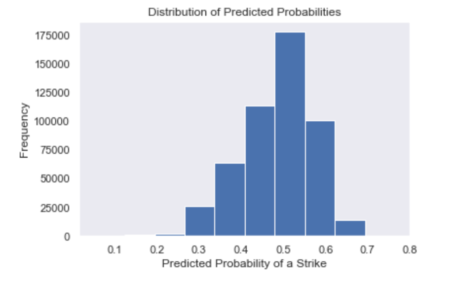
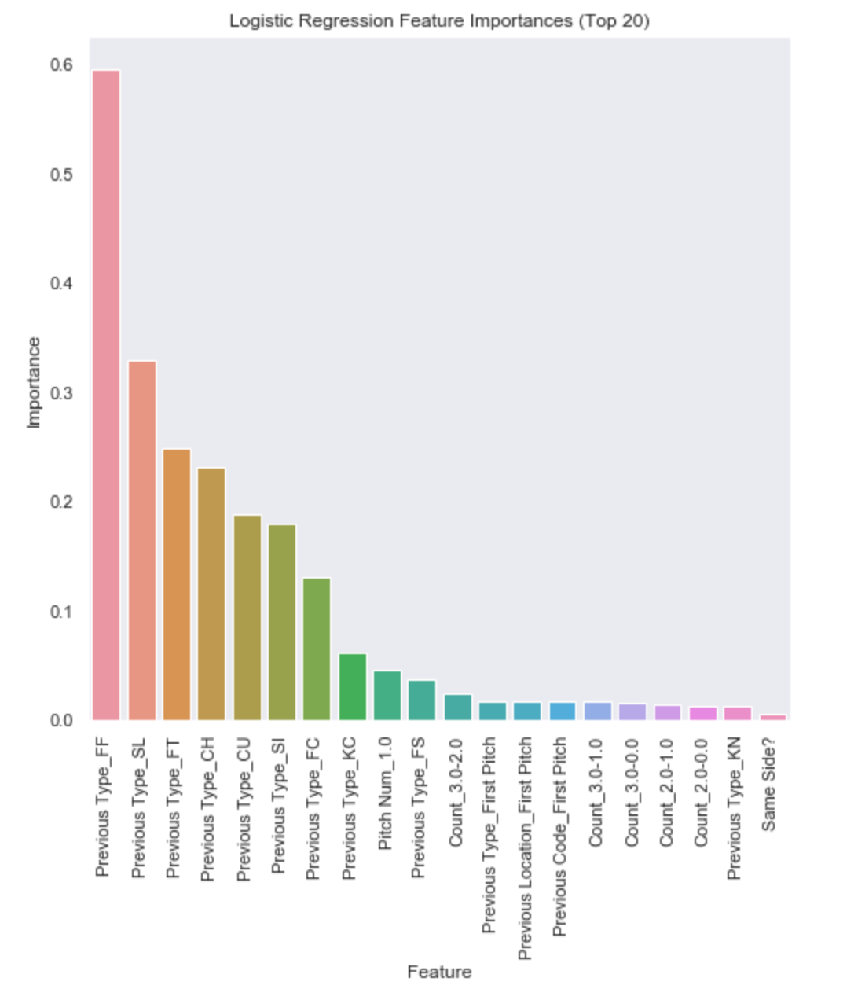
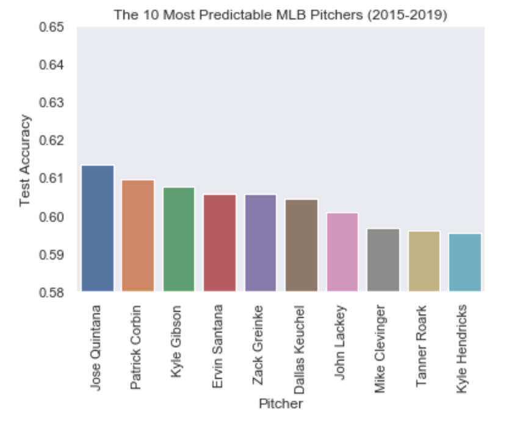
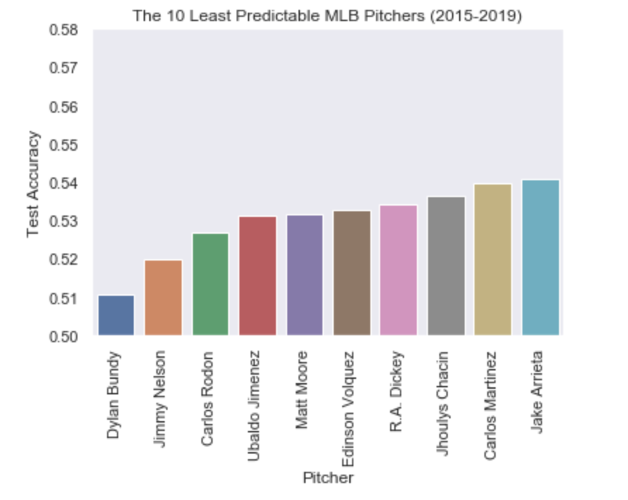
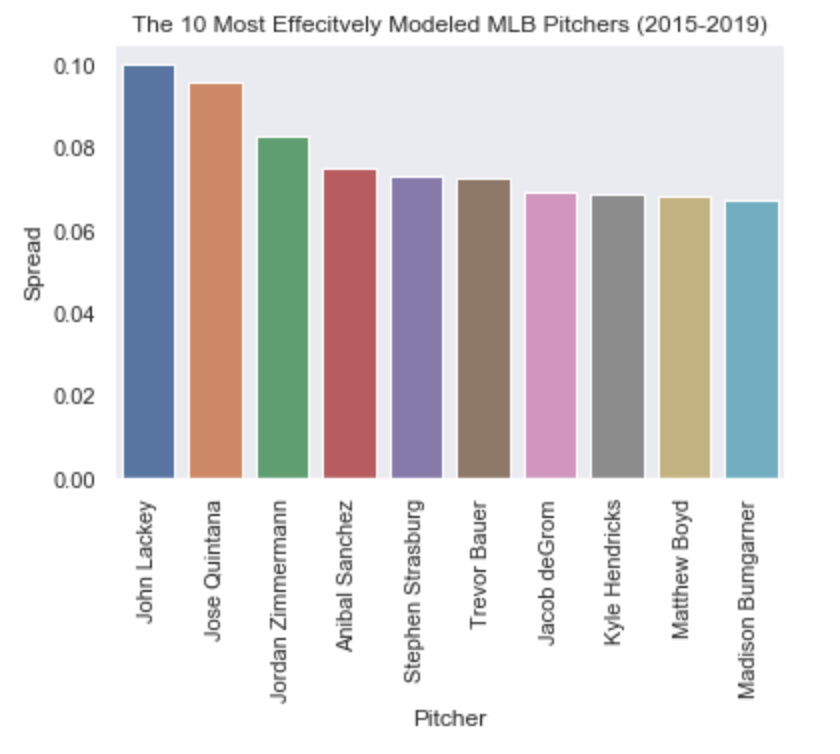
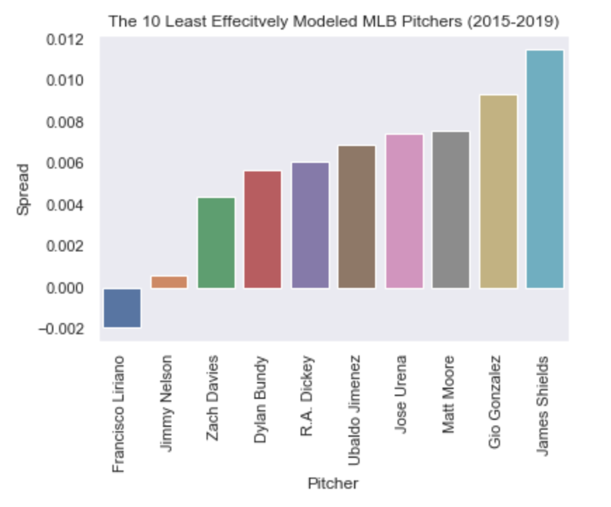

# MLB For Data Science: Predicting the Strikezone

By Ethan Schacht

## Introduction

Baseball is a game involving a large amount of chance.  In the MLB, the odds-favorites determined by sports betting algorithms win only 56% of the time and even the best players in history rarely achieve batting averages of above 0.350.  This randomness also occurs in regards to individual pitches, as the overall percentage of balls thrown in the strikezone is very close to 50%.  However, despite all of this randomness, it is possible to predict a strikezone pitch with greater accuracy than a pure guess.  In this notebook, I attempted to model whether or not a pitch will land in the strikezone with a large number of features.

## Purpose

Batters have very limited time to react after a pitch is thrown, so I do not believe a model involving variables such as pitch velocity, break angle, and current pitch type is practical for my purposes.  This model involved features that can be assessed before pitches, such as the ball-strike count, bases occupied, and previous pitch statistics.  Batters can use this information to determine their degree of preparation to swing at individual pitches, while pitchers can use this information to determine their own predictability and optimize the randomness of their pitch locations.

## Importing, Merging, and Cleaning the Data

[Data](https://www.kaggle.com/pschale/mlb-pitch-data-20152018) was imported from Kaggle.com and included the 2015 through 2019 seasons:  

- games.csv: game specific data such as teams, date, and attendance.
- atbats.csv: at bat specific data such as current score, at bat result, and inning.
- pitches.csv pitch specific data such as count, pitch location, and pitch type.
- player_names.csv: batter and pitcher names.

All of this data was then merged together to create a dataframe nearly 3.5 million rows long and 59 columns wide.  Cleaning included changing datatypes of a few variables (ex: converting "date" to a datetime variable) and renaming a couple of the keys to allow for merging.  The first and last names of each batter and pitcher were also combined to create full names.  Data could not be as easily scraped in the 2019 season, according to the owner of the datasets, so a few columns contain more or all missing values for that year.

## Feature Selection and Engineering

The most challenging part of this process was finding and creating variables that contain value in predicting whether or not a pitch hits the strikezone.  Variables fell under a large number of categories.

### The Strikezone Flag (Target Variable)

First, I created the variable I would attempt to predict.  The dimensions of the strikezone vary depending on the height of the batter, though official MLB rules   put it at a width of 19.94 inches and a height of 25.79 inches.  Based on the x and z locations of the pitch, I used a conditional statement to determine if the     pitch went through the official zone.

### Cumulative Batter and Pitcher Averages

It is feasible that pitchers may vary their pitch locations based on the strength of the opposing batter.  At the same time, pitchers may throw differently        depending on their own opposing batting averages. I created a total of 8 season cumulative variables, batting average (AVG), on-base percentage (OBP), slugging percentage (SLG), and on-base plus slugging percentage (OPS), for both the batter and pitcher.

- AVG: Calculated by dividing hits by at bats; measures the batter's ability to get hits.
- OBP: Caculated by dividing hits + walks + hit by pitches by at bats; measures the batter's ability to get on base.
- SLG: Calculaed by dividing total bases by at bats; measures the batter's ability to hit with power and achieve extra bases and home runs
- OPS: Calculated by adding OBP and SLG; measures the batter's combinded ability to get on base and hit with power.

### Game Situation Statistics

These statistics involve situations that commonly define each pitch and at bat.

- Batting and Pitching Team - Some teams may have different stategies, specifically against other teams, causing influence on the strikezone variable.
- Count and Pitch Number of Atbat: The ball-strike count may certainly be a key factor in predicting strikezone accuracy.  For example, pitchers often feel more inclined to throw a strike on a 3-0 count because one more ball will lead to the batter getting on base.  Long at bats may also influence the pitcher's strategy.
- Pitch Number of Game - Pitchers often become more exhausted as they throw more pitches into the game, affecting their strikezone accuracy.
- Bases Occupied: This variable records the bases that are occupied (there are 3 bases and 8 possible combinations).  Pitchers may feel more pressure to throw a certain way when there are more runs are close to scoring.
- Outs: Similarly to how many bases are occupied, the number of outs in the inning may put a certain type of pressure on the pitcher.
- Inning (Top or Bottom): The stakes often get higher as the game progresses, as relief and closing pitchers also replace starting pitchers.  Whether or not the the team is playing at home may also play a role.
- Lefty or Righty, Same Side Match-up?: Some batters and pitchers may feel inclined to throw their pitches differently based on the handedness of themselves and their opposing batter.  It is well-known that matchups involving the batter and pitcher having the same dominant hand (L vs. L and R vs. R) favors the pitcher relative to opposite handed matchups.  This variable also affects the angle at which the pitch is thrown.
- Run Difference: The score, and whether or not the same is close, may determine the strategy of the pitcher.  

### Previous Pitch and Event Statistics

Pitchers often develop habits based on data involving their previous pitch and events that occured in the previous at bat.

- Previous Pitch Location: This variable specifies the location of the previous pitch in different categories including strikezone, inside, high, both high and inside, etc.
- Previous Pitch Code:  This variable specifies the result of the previous pitch, including called strike, called ball, in play for an RBI, etc.
- Previous Pitch Type: This variable specifies the pitch type of the previous pitch, including fastball, curveball, slider, etc.
- Previous Event: This variable specifies the result of the previous at bat, including strikeouts, hits, walks, etc.

### Other Statistics

Finally, I engineered other miscellaneous variables that may influence strikezone accuracy.

- Pitcher Run Average of the Game (Runs Allowed / Innings Pitched): This variable track how well a pitcher is doing in a specific game.
- Pitcher Cumulative Strikezone Percentage of the Game: A pitcher's accuracy in a given day can easily influence their present mentality.
- Team Win-Loss Differential: This variable illustrates the team's overall performance.
- Opposing Team Win-Loss Differential: This variable illustrates the opposing team's overall performance.
- Previous Strikezone Percentage Against Opposing Batter: This variable is helpful in determining pitching habits against specific batters if that pitching matchup has occured before.
- Year and Month: I find it unlikely that strikezone percentages change too much over the course of months or years, though it's worth analyzing.

## Additional Data Preprocessing

Before building the model with this large number of features, some additional steps needed to be taken to ensure the best possible model accuracy and interpretation.

### Filtering Unnecessary Rows

This engineered dataset was still the size of the original 3.5 million row dataset.  However, there existed many unnecessary rows and values that could have resulted in an inefficient, less accurate model.  Rows with any of the following were extracted from the dataset:

- Intentional Walks: Intentional walks cannot involve strikes, so this value is of no importance to this study.
- Unusual Categorical Values: A few unusual values exist in this dataset that only occur a few times a year, making them statistically insignificant predictors of strikezone accuracy.  Examples include swinging pitchouts and 3rd base pickoffs.
- Values of Low Sample Size: Because I calculated batter and pitcher averages and strikezone averages throughout the game, error will arise in low-sample size situations that may show 100% batting averages after only 1 season at bat, for example.  Therefore, I filtered out rows where either the batter or pitcher hadn't taken or faced at least 30 at bats during the season.

After filtering, close to 2.8 million rows remained in the dataset.

### Feature Scaling 

I decided to use a standard scaler (scaling to unit variance).  Though I originally thought a robust scaler could work better due to various outliers within many numerical features, the standard scaler yielded a slightly better model.

### Encoding Features

Categorical features were one-hot encoded, resulting in 186 total predictors of the strikezone flag.  

## Logistic Regression: All Players

Finally, all of the data was run on a logistic regression model in order to predict the strikezone value.  Data was separated into 70% training data and 30% test data, and a more precise model score was found by means of cross validation with 5 folds of data.  As the strikezone target variable was very balanced at a baseline naive guess of approximately 51.4%, a simple accuracy score sufficed in evaluating these models, though I also used other metrics for evaluation such as f1-score and an ROC-AUC curve.

### Evaluation Metrics

**Accuracy Score**: The mean cross validation (5-fold) score yieled a test accuracy score of 56.6% which was only slightly below the training accuracy score of 56.7%, showing that the model did not overfit.  This score only beats a naive guess by 5.2 percentage points, but this is not bad considering the amount of randomness that goes into pitching.  Note that a given situation may cause a pitcher to intend to throw a ball in or out of the strikezone, though it is very common for them to miss their intended location.  

**Precision**: Out of all values that were predicted to be in the strikezone, 55.5% of them were correct.

**Recall/Sensitivity**: Out of all actual strikezone pitches, 56.5% of them were identified correctly.

**Specificity**: Out of all actual non-strikezone pitches, 57.1% were identified correctly.

**F1 Score**: The weighted average of precision and recall was 56.0%.

The model seems to do a slightly better job of predicting balls outside the strikezone than balls inside the strikezone, but not too significantly.  Accuracy score is a better metric for evalutating this model than f1 because it is easily interpretable and the target variable is evenly distributed.

### Tuning the Classification Threshold

This section will involve creating an ROC-AUC curve and using previous metrics to optimize the classification threshold, as well as tuning the threshold for practical purposes.

**ROC-AUC Curve**: Now, a curve that shows the trade-off between the true positive rate and false positive rate:

The area under the ROC curve, or the probability the a random strikezone pitch probability will rank above a random non-strikezone pitch probability, is 56.8%.  The optimal classification threshold that yields this accuracy score is about 49.6%.  This makes sense because the original model predicts non-strikezone pitches slightly better than it predicts strikezone pitches, so a lowering of this threshold allows a beneficial trade-off to call more strikezone pitches correctly.   

**What Threshold is Most Practical?**

In the previous section, we found a classification threshold that maximizes the accuracy of the model.  However, this might not be helpful to practical decisions a batter might make when deciding whether or not to swing at a pitch.  A batter shouldn't necessarily swing at a pitch just because a ball lands in the strikezone, as often times, a good pitch will land in the edge of strikezone which makes it more likely that a swing will result in a weak hit causing an out.  We should expect that balls likely to land on the edges of the strikezone will yield lower predicted strike probabilities than pitches that will land in the middle of the zone.  Therefore, a hitter should probably swing at a strike classification threshold somewhere greater than 50%.  In other words, this application should favor a low false positive rate over a high true positive rate, as precision will be a better metric than recall.  We will graph a distribution of predicted probabilities to get an idea of what threshold may be most practical and balanced.

The distribution appears very skewed to the left, meaning that the model was often more confident in predicting non-strikezone pitches than strikezone pitches, consistent with the earlier metrics.  If we are going to choose a threshold above 50%, it cannot be too high above that number.  This value is quite subjective, though we might start with a threshold of 53%, for example.  This would yield precision and specificity scores of 57.4% and 71.8%, respectively, while maintaining an accuracy score of 56.4% (originally 56.6%), meaning the model is correctly identifying non-strikezone pitches far better than before.  The trade-off is that the model is now doing a worse job of predicting strikezone pitches, but this is ok because the batter might not want to swing at a pitch that is more likely to catch the edge of the zone. 

### Feature Importance

There are many variables that were incorporated into this model, well over 100 after encoding, so it is very important to identify which ones were most important in predicting the strikezone.  The following is a plot of the top 20 features ordered by scaled coefficient in the logistic regression model.

We can see that the type of the previous pitch was most important in predicting the strikezone, especially whether or not the previous pitch was a four-seam fastball (FF).  The pitch number and pitch counts also seemed very important.  Specifically, three-ball counts (3-2, 3-1, 3-0) were quite predictive, and this doesn't surprise me because pitchers will likely feel inclined to throw strikes in these situations to avoid walking the batter on the next pitch.  

## Logistic Regression: Separated By Player

We just created a model across all MLB pitchers from 2015-2019 that predicts whether or not a ball will land in the strikezone.  However, perhaps the most important variable was left out: the pitcher himself.  It is very likely that different pitchers handle varying situations differently, and this will affect the predictability of their pitches.  We can think of the previous model's evaluation metrics as averages that tell a story of all MLB pitchers, so we would also expect that some pitchers will be significantly more predictable than 56.6% accuracy scores.  In this section, we will plot the least and most predictable pitchers out of those who are top 100 in pitches thrown over the past four seasons.

### The Most Predictable Pitchers

This section plots the 10 most predictable pitchers based on their raw predictability.

Jose Quintana's strikezone flag was predicted correctly over 61% of the time in the test set.  This is incredibly significant compared to the overall accuracy score, especially due to the randomness and confounding variables that surround this model.

### The Least Predictable Pitchers

This section plots the 10 least predictable pitchers based on their raw predictability.

These 10 pitchers randomize their pitchers better than anyone else in the league based on the many variables in this model.  Guessing Dylan Bundy's strikezone flag is nearly a 50-50 shot.

### The Most Effectively Modeled Pitchers

The previous two sections illustated the raw predictability of many pitchers, but it didn't take into account that a naive baseline may be high.  The overall non-strikezone percentage among all pitchers from 2015-2019 is 51.4%, but some pitchers may throw higher or even slightly lower percentages than this.  The following two sections will plot the spread between a naive guess and the accuracy score in order to show which pitchers are most effectively modeled with our variables.  First, the most effectively modeled pitchers.

Jose Quintana may be the most predictable pitcher, but our model actually performed better on John Lackey if the naive baseline is taken into account.  The model predicted his strikezone 10 percentage points higher than a naive guess!

### The Least Effectively Modeled Pitchers

Now, the least effectively modeled pitchers.

The model actually predicts Francisco Liriano's pitches worse than a naive guess, though this value would likely converge to spread of 0 or slightly greater if the model was bootstrapped.  Still, the model has absolutely no effectiveness on this pitcher.

## Conclusion

In this project, I engineered many variables that could be effective in predicting whether or not a pitch would cross the plane of the strikezone.  After some preprocessing, I then created both a comprehensive model and a model separated by individual pitchers.  As I expected before beginning this project, these models illustrate that pitch location is quite random and difficult to predict, but not completely unpredictable, especially if we analyze individual pitchers.  Therefore, these models could certainly serve some practical purpose in a batter's approach to facing a pitcher.  Of course, the batter has some time to react to an approaching pitch, so a model such as this one shouldn't be used as a primary factor in determining whether or not to swing at a pitch.  However, baseball is a game where the smallest of adjustments can make huge differences, so this model might be helpful in at least telling a batter the extent to which they should be prepared to swing at a pitch.

### Possible Improvements

Lastly, there are certainly more elements I could have included in this project and may include in the future.  These improvements include:

* More Algorithms For Modeling:
